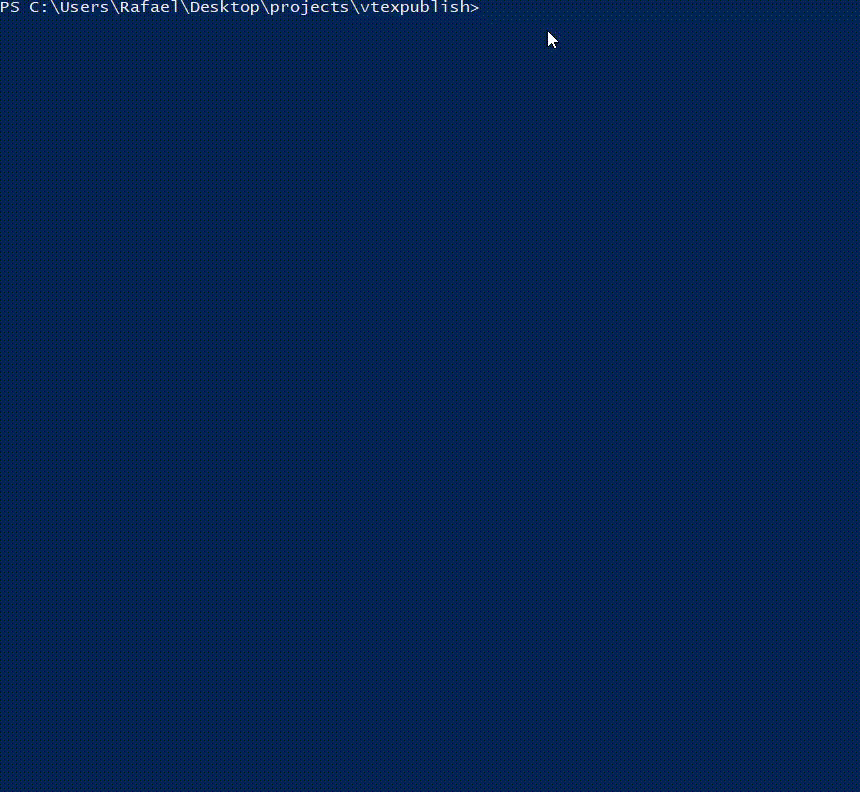

# Vtex Publish

Vtex Publish is designed to add files and templates to the vtex platform.



## Getting Started

These instructions will get you a copy of the project up and running on your local machine for development and testing purposes. See deployment for notes on how to deploy the project on a live system.

Make Git Clone this repository

```ssh
git clone https://github.com/savanajs/vtexpublish.git
```

### Prerequisites

What things you need to install the software and how to install them

- NodeJS > 8

## What he can do

- User Authentication
- Uploading JS files (/arquivos)
- Upload CSS files (/arquivos)
- Uploading PDF files (/arquivos)
- Upload XML files (/arquivos)
- Uploading Images (/arquivos) files
- Upload HTML templates
- Upload sub-templates HTML
- HTML upload from shelves
- Upload files and templates at checkout (/files)
- HTMLLint

*** Add hashes to CSS and JS file calls to Publish. ***

```html
<!DOCTYPE html>
<html>
  <head>
    <title>VTEX</title>
    <link href="style.css?v=0121254564" />
    <link href="style2.css?v=0121254564" />
  </head>
  <body>
    <h1>Content of exemple</h1>
  </body>
</html>
```

## Structure

All files for the upload must be inside the src and in their respective folders.

- src
  - arquivos
    - js
    - css
    - pdf
    - xml
    - images (jpg, png, gif, ico)
  - files (css, js,html of checkout)
  - shelfs (html)
  - sub-templates (html)
  - templates (html)
  
## Vtex Config

In the file vtex.config.json it will be possible to define which files should be active and added to the platform. If no files are defined in the array of each type, all files in the folder are added to the platform.
  
```json
{
    "publish": {
        "templates": [],
        "sub_templates": [],
        "shelf": [],
        "images": [],
        "pdf": [],
        "xml": [],
        "js": [],
        "css": [],
        "files": [],
        "files": ["checkout.css","header-checkout.html"]
    },
    "import": {
        "templates": {
            "prefix": ""
        }
    },
    "make_uploads": {
        "templates": true,
        "sub_templates": true,
        "shelf": true,
        "images": true,
        "pdf": false,
        "xml": false,
        "js": true,
        "css": true,
        "files": false,
        "files_templates": false
    },
    "checkoutRulesEnv": {
        "corebiz": "default"
    }
}

```

#### CheckoutRulesEnv to Publish

Insert the Environment Checkout of your project, in new stores use 'default' in others stores use the Environment correct or files in default Will be subscribed

## Publish (./src/publish/project name)

To upload image files and templates

```
npm run vtex-publish
```

## Import (./src/import/project name)

To download image files and templates

```
npm run vtex-import
```

## Log Erros

In the file **vtex.errors.log** is located in the upload process for the CMS

## Deployment

Add additional notes about how to deploy this on a live system

## Built With

* [Dropwizard](http://www.dropwizard.io/1.0.2/docs/) - The web framework used
* [Maven](https://maven.apache.org/) - Dependency Management
* [ROME](https://rometools.github.io/rome/) - Used to generate RSS Feeds

## Contributing

Please read [CONTRIBUTING.md](https://gist.github.com/PurpleBooth/b24679402957c63ec426) for details on our code of conduct, and the process for submitting pull requests to us.

## Authors

* **Rafael cruz** - *Initial work* - [Linkedin](https://www.linkedin.com/in/rafaelcr1/)

See also the list of [contributors](https://github.com/your/project/contributors) who participated in this project.

## License

This project is licensed under the MIT License - see the [LICENSE.md](LICENSE.md) file for details

